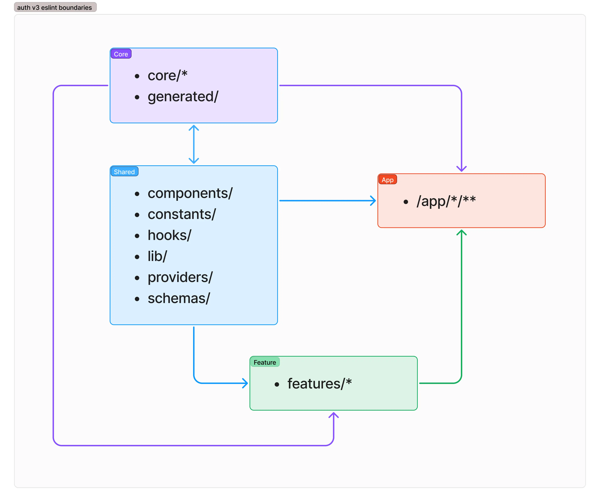

# ESLint Boundaries Configuration

This project uses **eslint-plugin-boundaries** to enforce a clean and maintainable folder structure.  
It prevents **circular dependencies**, **unauthorized imports**, and **tight coupling** between architectural layers.

## Table of Contents

- [Folder Architecture](#folder-architecture)
- [Boundaries Types](#boundaries-types)
- [Import Rules Summary](#import-rules-summary)
- [Visual Diagram](#visual-diagram)
- [ESLint Rules Overview](#eslint-rules-overview)
- [Benefits](#benefits)
- [Reference](#reference)

## Folder Architecture

The `src` directory is structured into several **layer types**, each serving a specific purpose in the app:

```
src/
├── app/ → Next.js routes, layouts, and pages
├── components/ → Shared UI components
├── constants/ → Shared constants and enums
├── core/ → Core logic
│ ├── admin/
│ ├── auth/
│ ├── emails/
│ ├── table/
│ └── user/
├── features/ → Business logic grouped by domain (feature folders)
│ ├── profile/
│ └── settings/
├── generated/ → Auto-generated Prisma and type files
├── hooks/ → Reusable React hooks
├── lib/ → Client utilities
├── providers/ → React context providers
├── schemas/ → Zod schemas and validators
└── types/ → Global TypeScript types
```

## Boundaries Types

Each directory is categorized as a **boundary element type** in ESLint:

| Type                                       | Description                                        | Example Path                      |
| ------------------------------------------ | -------------------------------------------------- | --------------------------------- |
| [**core**](./eslint.config.mjs#L15)        | Application core logic — core services             | `src/core/**`                     |
| [**shared**](./eslint.config.mjs#L21)      | Reusable UI and utilities shared across the app    | `src/components/**`, `src/lib/**` |
| [**feature**](./eslint.config.mjs#L34)     | Feature-specific domain modules                    | `src/features/*/**`               |
| [**app**](./eslint.config.mjs#L40)         | Next.js route layer — pages, layouts, API routes   | `src/app/**`                      |
| [**neverImport**](./eslint.config.mjs#L46) | Catch-all layer used to disallow imports from root | `src/*`                           |

## Import Rules Summary

These rules define **who can import from where**:

| From                                       | Can import                              | Notes                                                             |
| ------------------------------------------ | --------------------------------------- | ----------------------------------------------------------------- |
| [**core**](./eslint.config.mjs#L15)        | → `core`, `shared`                      | Core is the foundation layer.                                     |
| [**shared**](./eslint.config.mjs#L21)      | → `core`, `shared`                      | Shared utilities can depend on other shared or core logic.        |
| [**feature**](./eslint.config.mjs#L34)     | → `core`, `shared`, same `feature` only | Each feature can import its own files, but not another feature’s. |
| [**app**](./eslint.config.mjs#L40)         | → `core`, `shared`, `feature`           | Pages can consume any internal layer.                             |
| [**neverImport**](./eslint.config.mjs#L46) | 🚫 Cannot import anything               | Used as a safeguard rule.                                         |

## Visual Diagram

 

## ESLint Rules Overview

Key rules defined in `eslint.config.mjs`:

| Rule                          | Description                                       |
| ----------------------------- | ------------------------------------------------- |
| `boundaries/no-unknown`       | Ensures all imports match a known boundary.       |
| `boundaries/no-unknown-files` | Prevents unknown or misplaced files.              |
| `boundaries/element-types`    | Defines allowed import directions between layers. |

## Benefits

- Prevents **accidental cross-feature imports**.
- Keeps **core logic isolated** from UI.
- Enforces **modular, scalable architecture**.
- Makes refactoring and maintenance much safer.

## Reference

- [eslint-plugin-boundaries Documentation](https://github.com/javierbrea/eslint-plugin-boundaries)
- [Next.js Documentation](https://nextjs.org/docs)
